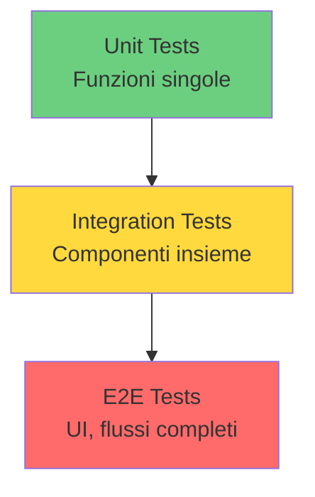

# Introduzione a Playwright

<SectionTitle title="01" />

---

# La Piramide del Testing

<div class="grid grid-cols-2 gap-8">

<div>

## 🏔️ Test Pyramid



</div>

<div>

## 📊 Tipologie

<v-clicks>

**Unit Test**
- Verifica singola funzionalità
- Veloci, isolati
- Alta copertura

**Integration Test**
- Componenti insieme
- Interazioni tra moduli
- Flussi intermedi

**E2E Test**
- Simulano utenti reali
- Flusso completo
- Browser reale

</v-clicks>

</div>

</div>

---

# E2E Testing: Perché sono Utili

<div class="grid grid-cols-2 gap-6">

<div>

## ✅ Vantaggi

<v-clicks>

**1. Verificano Flussi Completi**
- User journey reali
- Dal login al checkout
- Come utente vero

**2. Errori Complessi**
- Bug che emergono solo in prod
- Race conditions
- Casi edge realistici

**3. Maggiore Confidenza**
- "Se passa, funziona"
- Deploy sicuri
- Meno stress

**4. Documentazione Vivente**
- Test = specifica
- Documentation Driven Development
- Sempre aggiornata

</v-clicks>

</div>

<div>

## 📈 ROI dei Test E2E

```js
// Un test E2E può prevenire:
const bug_in_prod = {
  costo_fix: '4-8 ore dev',
  downtime: '2-4 ore',
  utenti_impattati: '1000+',
  reputazione: 'danneggiata'
};

const test_e2e = {
  costo_scrittura: '1-2 ore',
  esecuzione: '2-5 min',
  catch_before_prod: true,
  peace_of_mind: '✨'
};
```

<v-click>

<div class="mt-4 p-4 bg-green-500 bg-opacity-10 rounded">

**Cost of Quality**: Trovare bug in prod costa 10-100x più che in sviluppo

</div>

</v-click>

</div>

</div>

---

# E2E Testing: Perché sono Difficili

<div class="grid grid-cols-2 gap-8">

<div>

## ⚠️ Sfide Tradizionali

<v-clicks>

**1. Instabili (Flaky)**
```js
// Problemi classici
await driver.findElement(By.id('btn'));
await driver.sleep(2000); // 😱
await driver.click('#btn');
// A volte passa, a volte no...
```

**2. Lenti**
- Setup browser lento
- Attese manuali
- Esecuzione sequenziale

**3. Difficili da Mantenere**
- Selettori fragili
- Codice duplicato
- Refactoring UI → test rotti

</v-clicks>

</div>

<div>

<v-clicks>

**4. Setup Complesso**
```bash
# Configurazione tradizionale
- Install WebDriver
- Setup browser binaries
- Configure Grid
- Handle dependencies
- Manage versions
- ...ore di setup 😓
```

**5. Gestione Dipendenze**
- Database
- API esterne
- Servizi third-party
- Stato condiviso tra test

**Il Risultato?**
- Team evita scrivere E2E test
- Coverage bassa
- Bugs in produzione 🐛

</v-clicks>

</div>

</div>

---

# Enter Playwright 🎭

<div class="grid grid-cols-2 gap-8">

<div>

## 🚀 Cos'è Playwright?

**Framework open source di Microsoft** per automazione e testing web

<v-clicks>

**Nato nel 2020**
- Team dietro Puppeteer
- Esperienza Chrome DevTools Protocol
- Focus su developer experience

**Obiettivo**
> Rendere il testing E2E **affidabile**, **veloce** e **semplice**

</v-clicks>

<v-click>

```bash
# Setup in 2 minuti
npm init playwright@latest

# Fatto! 🎉
npx playwright test
```

</v-click>

</div>

<div>

## 🌟 Chi lo Usa?

<v-clicks>

**Microsoft** (ovviamente)
- Bing, VS Code, Teams

**Tech Giants**
- Adobe, Salesforce
- React, Vue, Angular docs

**Enterprises**
- Financial services
- E-commerce
- SaaS companies

**Adoption**
- 60k+ GitHub stars
- 3M+ weekly npm downloads
- Growing community

</v-clicks>

</div>

</div>

---

# Quali Problemi Risolve?

<div class="grid grid-cols-2 gap-6 text-sm">

<div>

## ❌ Prima (Selenium/Altri)

```js
// Test instabile
const el = await driver.findElement(By.id('btn'));
await driver.sleep(2000); // Quanto aspettare?
await el.click();
await driver.sleep(1000);

// Selettori fragili
await driver.findElement(
  By.css('div > span.btn-primary')
); // Si rompe facilmente

// Multi-browser complesso
if (browser === 'chrome') { /* ... */ }
if (browser === 'firefox') { /* ... */ }

// Setup lungo
await driver.manage().timeouts()
  .implicitlyWait(10000);
await driver.manage().window().maximize();
// ... altra config
```

</div>

<div>

## ✅ Con Playwright

```js
// Auto-waiting: niente sleep!
await page.click('#btn');
// Aspetta automaticamente che sia:
// - visibile, stabile, enabled

// Selettori semantici
await page.getByRole('button',
  { name: 'Submit' }
);
// Resiliente e accessibile!

// Multi-browser: stessa API
const { chromium, firefox, webkit }
  = require('playwright');
// Funziona su tutti!

// Zero config
import { test } from '@playwright/test';
test('works', async ({ page }) => {
  // Browser già pronto!
});
```

</div>

</div>

<div class="text-center mt-6">

**Playwright risolve i problemi che rendevano i test E2E difficili**

</div>

---

# Principi Cardine di Playwright

<div class="grid grid-cols-3 gap-6">

<div class="p-6 bg-blue-500 bg-opacity-10 rounded">

### 🎯 Affidabilità

<v-clicks>

**Auto-waiting**
- Aspetta visibilità
- Aspetta stabilità
- Aspetta interattività

**Web-first assertions**
- Retry automatico
- Niente flaky test

**No race conditions**
- Eventi nativi browser
- Timing preciso

</v-clicks>

</div>

<div class="p-6 bg-green-500 bg-opacity-10 rounded">

### ⚡ Velocità

<v-clicks>

**Parallelizzazione**
- Worker multipli
- Test isolati
- Context separati

**Isolamento Totale**
- Browser: sessioni univoche
- Backend: responsabilità dev

**Performance**
- WebSocket diretto
- No intermediari
- Fast by default

</v-clicks>

</div>

<div class="p-6 bg-purple-500 bg-opacity-10 rounded">

### 🎨 Semplicità

<v-clicks>

**Multi-Browser**
- Una sola API
- Chromium, Firefox, WebKit
- Stesso codice

**Developer Experience**
- Setup veloce
- Tooling eccezionale
- Debug intuitivo

**Best Practices**
- Selettori accessibili
- Patterns moderni
- Docs complete

</v-clicks>

</div>

</div>

---

# Affidabilità in Profondità

<div class="grid grid-cols-2 gap-8">

<div>

## 🔍 Auto-Waiting

**Playwright aspetta automaticamente che l'elemento sia:**

<v-clicks>

1. **Attached** al DOM
2. **Visible** (non `display: none`)
3. **Stable** (non in animazione)
4. **Enabled** (non `disabled`)
5. **Editable** (se input)

```js
// Tutto questo automatico:
await page.click('button');

// vs Selenium:
await driver.wait(until.elementLocated(...), 5000);
await driver.wait(until.elementIsVisible(...), 5000);
await driver.wait(until.elementIsEnabled(...), 5000);
await element.click();
```

</v-clicks>

</div>

<div>

## 🔄 Web-First Assertions

```js
// Retry automatico fino a successo
await expect(page.getByText('Welcome'))
  .toBeVisible();

// vs asserzioni tradizionali:
let found = false;
for (let i = 0; i < 10; i++) {
  if (await isVisible()) {
    found = true;
    break;
  }
  await sleep(500);
}
assert(found);
```

<v-click>

<div class="mt-4 p-4 bg-blue-500 bg-opacity-10 rounded">

**Risultato**: Test stabili, zero flakiness

Playwright gestisce timing per te!

</div>

</v-click>

</div>

</div>

---

# Velocità: Parallelizzazione

<div class="grid grid-cols-2 gap-8">

<div>

## 🚀 Esecuzione Parallela

```js
// playwright.config.ts
export default defineConfig({
  workers: 4, // 4 test in parallelo!
});
```

<v-click>

**Risultati**:
```bash
# Sequenziale (1 worker)
✓ 100 tests in 10min

# Parallelo (4 workers)
✓ 100 tests in 2.5min

# 4x più veloce! 🚀
```

</v-click>

</div>

<div>

## 🔒 Isolamento Totale

<v-clicks>

**Browser Context**
- Ogni test = context isolato
- Cookie separati
- Storage separato
- Session separata

```js
// Playwright garantisce isolamento
test('test 1', async ({ page }) => {
  // Context 1
});

test('test 2', async ({ page }) => {
  // Context 2 - completamente isolato!
});
```

**Backend**
- DB: usa transaction o cleanup
- API: mock o sandbox
- State: reset tra test

</v-clicks>

</div>

</div>

---

# Semplicità: Multi-Browser

<div class="grid grid-cols-2 gap-8">

<div>

## 🌐 Una Sola API

```js
// Stesso codice per tutti i browser!
import { test } from '@playwright/test';

test('works everywhere', async ({ page }) => {
  await page.goto('https://example.com');
  await page.click('button');
  await expect(page).toHaveURL(/success/);
});
```

<v-click>

**Config**:
```js
projects: [
  { name: 'chromium', use: devices['Desktop Chrome'] },
  { name: 'firefox', use: devices['Desktop Firefox'] },
  { name: 'webkit', use: devices['Desktop Safari'] },
]
```

</v-click>

</div>

<div>

## 🎯 Browser Support

| Browser | Engine | Coverage |
|---------|--------|----------|
| Chrome | Chromium | ✅ 100% |
| Edge | Chromium | ✅ 100% |
| Firefox | Firefox | ✅ 100% |
| Safari | WebKit | ✅ ~98% |

<v-click>

**Bonus**: Mobile emulation
```js
use: {
  ...devices['iPhone 13'],
  ...devices['Pixel 5'],
  ...devices['iPad Pro']
}
```

</v-click>

<v-click>

<div class="mt-4 p-4 bg-green-500 bg-opacity-10 rounded text-sm">

**Cross-browser testing senza sforzo**

Scrivi una volta, testa ovunque!

</div>

</v-click>

</div>

</div>

---

# Recap Introduzione

<div class="grid grid-cols-2 gap-8">

<div>

## 📚 Cosa Abbiamo Visto

<v-clicks>

**Testing Pyramid**
- Unit, Integration, E2E
- Quando usare E2E

**E2E Testing**
- ✅ Vantaggi: confidence, coverage
- ⚠️ Sfide: flaky, slow, complex

**Playwright**
- Framework moderno di Microsoft
- Chi lo usa e perché

</v-clicks>

</div>

<div>

<v-clicks>

**Problemi Risolti**
- Auto-waiting (no sleep!)
- Selettori semantici
- Multi-browser semplice

**Principi Cardine**
- 🎯 Affidabilità
- ⚡ Velocità
- 🎨 Semplicità

**Next**: Concetti core in dettaglio!

</v-clicks>

</div>

</div>

<div class="text-center mt-8">

**Ora capiamo COME funziona** →

</div>
