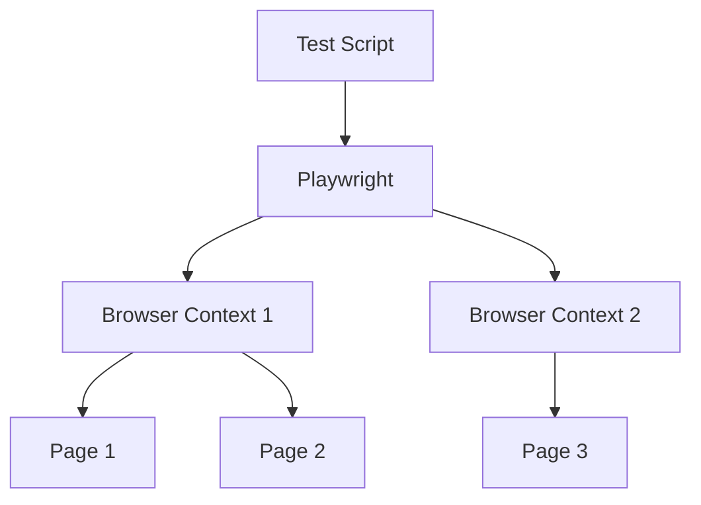

# Concetti Core

<SectionTitle title="02" />

---

# Architettura

<div class="grid grid-cols-2 gap-8">

<div>

## 🏗️ Design



**Isolamento completo**
- Ogni context è indipendente
- Cookie e storage separati
- Parallelizzazione nativa

</div>

<div>

## 🔌 Comunicazione Diretta

**WebSocket al browser**
- Nessun WebDriver intermediario
- Controllo completo dell'automazione
- Eventi nativi del browser

**Multi-browser**
```js
// Chromium, Firefox, WebKit
const { chromium } = require('playwright');
const { firefox } = require('playwright');
const { webkit } = require('playwright');
```

</div>

</div>

---

# Selettori

<div class="grid grid-cols-2 gap-6">

<div>

## 🎯 Strategie

```js
// 1. Role-based (raccomandato)
await page.getByRole('button',
  { name: 'Invia' });

// 2. Label (per form)
await page.getByLabel('Email');

// 3. Placeholder
await page.getByPlaceholder('cerca...');

// 4. Text content
await page.getByText('Login');

// 5. Test ID (stabile)
await page.getByTestId('submit-btn');
```

</div>

<div>

## ✨ Vantaggi

<v-clicks>

- **Resilienti**: non si rompono con refactoring CSS
- **Semantici**: leggibili e comprensibili
- **Accessibili**: seguono best practice a11y
- **Combinabili**: catene di selettori

```js
// Selezione combinata
await page
  .getByRole('navigation')
  .getByRole('link', { name: 'Home' })
  .click();
```

</v-clicks>

</div>

</div>

---

# Auto-Waiting

<div class="grid grid-cols-2 gap-6">

<div>

## ❌ Prima

```js
// Attese manuali
await driver.findElement(By.id('btn'));
await driver.sleep(2000); // 😱

await driver.findElement(By.id('btn')).click();
await driver.sleep(1000);
```

</div>

<div>

## ✅ Playwright

```js
// Auto-waiting integrato! 🎉
await page.click('#btn');

// Aspetta automaticamente:
// ✓ Visibile
// ✓ Stabile
// ✓ Enabled
```

<v-click>

**Test più affidabili, meno flaky!**

</v-click>

</div>

</div>

---

# Assertions

<div class="grid grid-cols-2 gap-6">

<div>

## 🎯 Web-First

```js
// Retry automatico
await expect(page.getByRole('heading'))
  .toBeVisible();

await expect(page.getByRole('button'))
  .toBeEnabled();

await expect(page)
  .toHaveURL(/dashboard/);
```

</div>

<div>

## 🔄 Auto-Retry

Ogni assertion:
1. Esegue il controllo
2. Riprova se fallisce
3. Passa quando soddisfatta

```js
// Basta questo:
await expect(page.getByText('text'))
  .toBeVisible();
```

<v-click>

`toBeVisible`, `toBeEnabled`, `toHaveText`, `toHaveURL`, `toHaveCount`...

</v-click>

</div>

</div>

---

# Debugging

<div class="grid grid-cols-2 gap-6">

<div>

## 🔍 Tools

```bash
# UI Mode (raccomandato)
npx playwright test --ui

# Debug Mode
npx playwright test --debug

# Breakpoint
await page.pause();
```

### 📸 Screenshots

```js
await page.screenshot({
  path: 'screenshot.png'
});
```

</div>

<div>

## 🎬 Trace Viewer

```bash
# Genera trace
npx playwright test --trace on

# Visualizza
npx playwright show-trace trace.zip
```

**Include**: DOM, network, console, screenshots

<v-click>

```js
use: { trace: 'retain-on-failure' }
```

</v-click>

</div>

</div>

---

# Network Interception

<div class="grid grid-cols-2 gap-6 text-sm">

<div>

## 🌐 Mock API

```js
// Mock risposta
await page.route('**/api/users', route => {
  route.fulfill({
    status: 200,
    body: JSON.stringify([
      { id: 1, name: 'Alice' }
    ])
  });
});

// Modifica risposta
await page.route('**/api/**', async route => {
  const response = await route.fetch();
  const json = await response.json();
  json.modified = true;
  route.fulfill({ json });
});
```

</div>

<div>

## 📊 Aspettare Network

```js
// Aspetta chiamata specifica
const response = await page.waitForResponse(
  res => res.url().includes('/api')
    && res.status() === 200
);

const data = await response.json();

// Aspetta caricamento
await page.waitForLoadState('networkidle');
```

<v-click>

**Use case**: Test isolati, simulare errori, offline

</v-click>

</div>

</div>

---

# Context e Isolamento

<div class="grid grid-cols-2 gap-8 text-sm">

<div>

## 🔐 Browser Context

```js
const browser = await chromium.launch();

// Context 1: utente loggato
const context1 = await browser.newContext();
await context1.addCookies([
  { name: 'session', value: '123' }
]);

// Context 2: utente guest
const context2 = await browser.newContext();

// Isolamento totale!
```

**Vantaggi**:
- Storage separato
- Cookie separati
- Più veloce del riavvio browser

</div>

<div>

## 🌍 Configurazione

```js
const context = await browser.newContext({
  geolocation: {
    latitude: 41.9,
    longitude: 12.5
  },
  permissions: ['geolocation'],
  timezoneId: 'Europe/Rome',
  locale: 'it-IT',
  viewport: { width: 1280, height: 720 }
});
```

<v-click>

**Use case**: Test multi-utente, diversi fusi orari, mobile vs desktop

</v-click>

</div>

</div>

---

# Recap Concetti Core

<div class="grid grid-cols-3 gap-6 text-sm">

<div class="p-4 bg-blue-500 bg-opacity-10 rounded">

### 🏗️ Architettura
- WebSocket diretto
- Multi-browser nativo
- Context isolati

</div>

<div class="p-4 bg-green-500 bg-opacity-10 rounded">

### 🎯 Selettori
- Role-based
- Semantici
- Resilienti

</div>

<div class="p-4 bg-purple-500 bg-opacity-10 rounded">

### ⚡ Auto-Waiting
- Niente sleep
- Retry automatico
- Test stabili

</div>

<div class="p-4 bg-orange-500 bg-opacity-10 rounded">

### ✅ Assertions
- Web-first
- Auto-retry
- Potenti

</div>

<div class="p-4 bg-red-500 bg-opacity-10 rounded">

### 🔍 Debugging
- UI Mode
- Trace Viewer
- Inspector

</div>

<div class="p-4 bg-yellow-500 bg-opacity-10 rounded">

### 🌐 Network
- Intercept
- Mock
- API testing

</div>

</div>

<div class="text-center mt-8">

**Prossimo step**: Demo Live! 🚀

</div>
