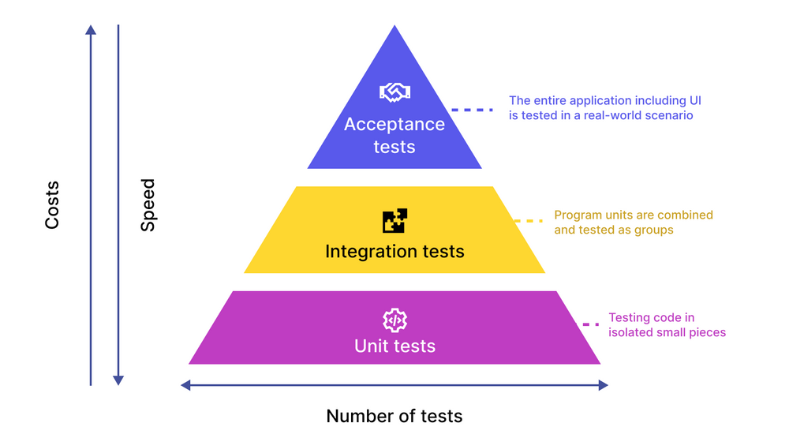

# La Piramide dei Test

---

# I Vantaggi dei Test E2E

**Confidenza**

- Simula l'esperienza utente reale
- Verifica il flusso completo dell'applicazione
- Aumenta la fiducia nel rilascio

**Copertura**

- Testa l'integrazione di tutti i componenti
- Rileva bug che i test unitari non possono trovare
- Copre scenari complessi e realistici

**Qualità**

- Garantisce la funzionalità critica del business
- Migliora la qualità percepita dall'utente
- Riduce i rischi di regressione

---

# Le Sfide dei Test E2E

I test End-to-End (E2E) sono cruciali per garantire che un'applicazione funzioni correttamente nel suo complesso, simulando il percorso dell'utente finale. Tuttavia, la loro implementazione e manutenzione presentano sfide significative che li rendono complessi e costosi.

**Costo**

- Setup complesso
- Ambiente completo
- Dati di test
- Manutenzione alta

**Velocità**

- Browser rendering
- Network calls
- Attese UI
- Esecuzione sequenziale

**Fragilità**

- UI changes
- Timing issues
- Dipendenze esterne
- Flaky tests

