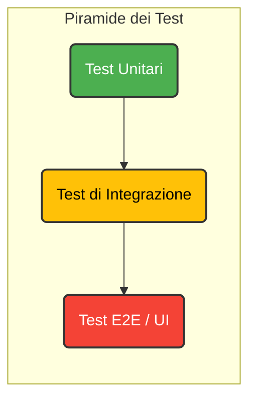

# La Piramide dei Test

  Capitolo 1 — Fondamenti

  
 <h3>Strategia di Testing</h3>

  

  

    <h3>Tipologie di Test</h3>
  

---

# Perché E2E sta in Cima?

**Costo**

- Setup complesso
- Ambiente completo
- Dati di test
- Manutenzione alta

**Velocità**

- Browser rendering
- Network calls
- Attese UI
- Esecuzione sequenziale

**Fragilità**

- UI changes
- Timing issues
- Dipendenze esterne
- Flaky tests

