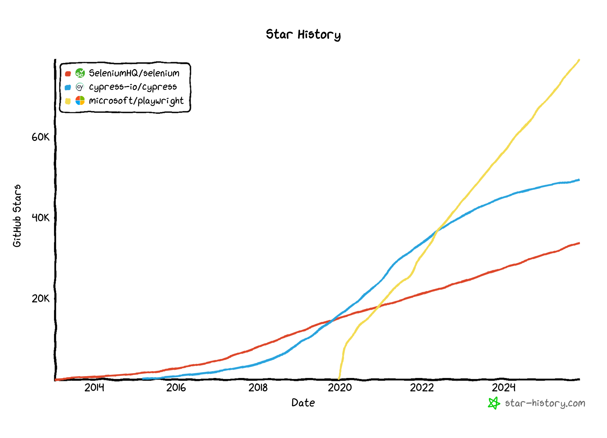

# 🎭 Enter Playwright 🎭

---

# Enter Playwright 🎭

<div class="grid grid-cols-2 gap-8 mt-4">

<div><h3>Cos'è?</h3>

Framework open source di **Microsoft** per automazione e testing web

```bash
# Setup
npm init playwright@latest

# utilizzo
npx playwright test
```


</div>

<div><h3>Chi lo usa? Ci sono alternative?</h3>

  
</div>

</div>

<!--
A differenza di molti altri strumenti non richide configurazioni complesse
Sufficiente installarlo per inizare a lavorare
Un unico comando per eseguire i test.

Rispetto alle alternative più "classic" come selenium e cypress è molto più giovane ma ha di gran lunga sorpassato la concorrenza
-->

---

# I 3 Pilastri di Playwright

<div class="grid grid-cols-3 mt-8">

<div class="card">

### <span class="emoji-medium">🎯</span> Affidabilità

**Auto-waiting**
- Aspetta visibilità
- Aspetta stabilità
- Aspetta interattività

**Web-first assertions**
- Retry automatico
- Niente flaky test

</div>

<div class="card">

### <span class="emoji-medium">⚡</span> Velocità

**Parallelizzazione**
- Worker multipli
- Test isolati
- Context separati

**Performance**
- WebSocket diretto
- Fast by default

</div>

<div class="card">

### <span class="emoji-medium">🎨</span> Semplicità

**Multi-Browser**
- Una sola API
- Chromium, Firefox, WebKit

**Developer Experience**
- Setup veloce
- Tooling eccezionale
- Debug intuitivo

</div>

</div>


---

# Auto-Waiting


<div class="grid grid-cols-3 gap-8 mt-8">

<div class="col-span-2">

```js
import { test, expect } from '@playwright/test';

test('get started link', async ({ page }) => {
  await page.goto('https://playwright.dev/');

  await page.getByRole('link', { name: 'Get started' }).click();

  await expect(page.getByRole('heading', { name: 'Installation' })).toBeVisible();
});
```

</div>

<div>

- Controlli automatici:
  - Univocità del selettore
  - Elemento visibile 
  - Elemento stabile (no animazioni)
  - Non coperto da altri elementi
  - NON disabilitato

</div>


</div>

<!--
Il framework si accolla tutte le parti complicate, come sviluppatori dobbiamo solamente dire con che cosa interagire in che modo.
Una volta specificato il selettore il sistema garantsice che l'istruzione verrà eseguita solamente nel momento in cui la pagina è pronta
-->

---

# Selettori Semantici

<div class="grid grid-cols-2 mt-4">

<div>

### Best Practice Built-in

```js
// Role-based
await page.getByRole('button',
  { name: 'Invia' });

// Label
await page.getByLabel('Email');

// Placeholder
await page.getByPlaceholder('Cerca...');

// Text
await page.getByText('Login');
```

</div>

<div>

### Vantaggi

**Resilienti**
- Non si rompono con refactoring CSS

**Semantici**
- Leggibili e comprensibili

**Accessibili**
- Seguono best practice a11y

**Stabili**
- Test ID per elementi dinamici

</div>

</div>

<!--
Si basano sull'accessability model del browser.
In pratica, ad ogni elemento viene assegnato un ruolo ed un nome.

Se fatto bene, molto più stabile dei selettori classici basati su jquery

Ovviamente ha delle logiche di fallback, però non ce ne dobbiamo occupare troppo perché poi vedremo dei modi per aiutarci nella scrittura
-->

---

# Accessibility Syntax Tree

<div class="grid grid-cols-2 mt-4">

<div>

```html
<main>
  <h1>Accedi al tuo account</h1>
  
  <form>
    <div>
      <label for="user">Username:</label>
      <input id="user" type="text" placeholder="mario.rossi">
    </div>
    
    <button aria-label="Invia modulo di login">
      <svg>...</svg> Entra
    </button>
  </form>
</main>
```

</div>

<div>
```md
ROLE: generic (corrisponde a <main>)
 |
 +-- ROLE: heading, NAME: "Accedi al tuo account"
 |    |
 |    +-- ROLE: statictext, NAME: "Accedi al tuo account"
 |
 +-- ROLE: form
      |
      +-- ROLE: textbox, NAME: "Username:"
      |
      +-- ROLE: button, NAME: "Invia modulo di login"
```

> Accessibile tramite la dev console

</div>


</div>

<!--
https://developer.chrome.com/blog/full-accessibility-tree?hl=it
-->
