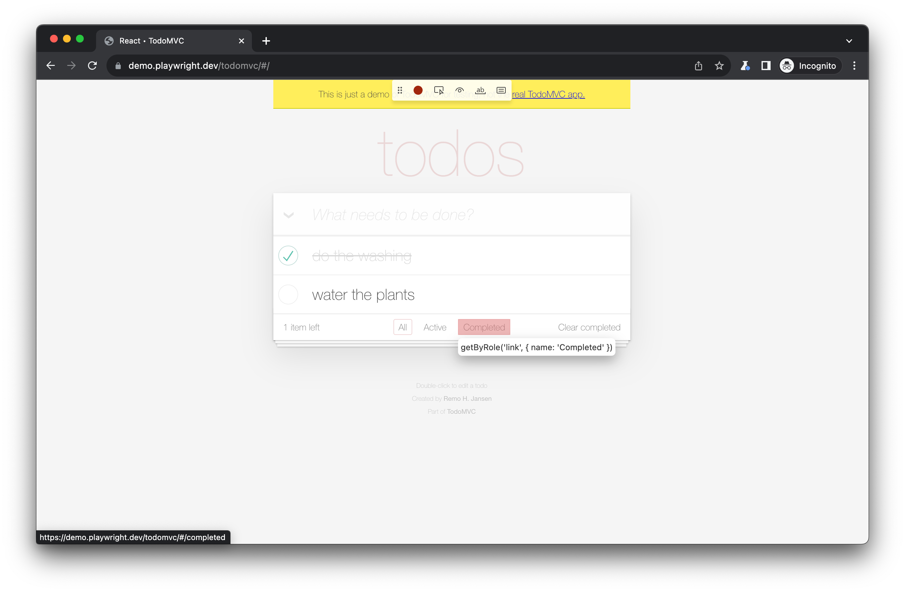
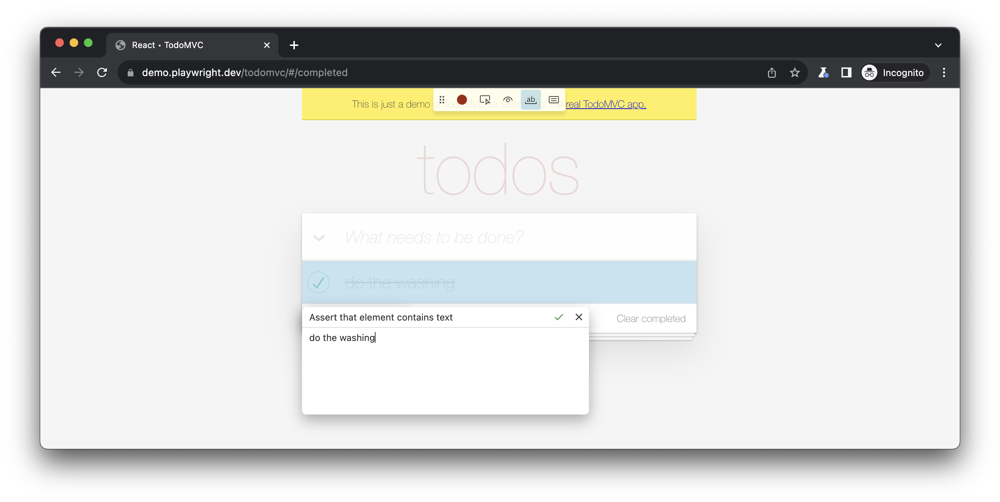

# Hands-On

---

# Primo Test


```js
import { test, expect } from '@playwright/test';

test('login con successo', async ({ page }) => {
  await page.goto('/login');

  await page.getByLabel('Email').fill('user@example.com');
  await page.getByLabel('Password').fill('password123');

  await page.getByRole('button', { name: 'Login' }).click();

  await expect(page).toHaveURL(/dashboard/); 
  await expect(page.getByText('Benvenuto')).toBeVisible();
});
```

---

# Eseguire i Test

<div class="grid grid-cols-2">

<div>

### Comandi Base

```bash
# Tutti i test
npx playwright test

# Test specifico
npx playwright test login.spec.ts

# Per nome
npx playwright test -g "login"

# Browser specifico
npx playwright test --project=chromium

# Debug mode
npx playwright test --debug

# UI Mode ⭐
npx playwright test --ui
```

</div>

<div>

### Output

```bash
Running 3 tests using 3 workers

✓ login.spec.ts:3 › login (2s)
✓ signup.spec.ts:5 › signup (3s)
✓ profile.spec.ts:7 › profile (2s)

3 passed (7s)
```

### HTML Reporter

```bash
npx playwright show-report
```

> Supporto a tool esterni: https://playwright.dev/docs/test-reporters

</div>

</div>

<!-- Inserire esempio di test report via screenshot -->


---

# Reportistica: Allure-JS

> Simple. Fun. Language and Framework agnostic. Designed to create fancy and clear testing reports in minutes
> https://allurereport.org/


---

# Codegen: Generazione automatica di test

<div class="grid grid-cols-2">

<div>

### Come Funziona

```bash
# Avvia Codegen
npx playwright codegen localhost:3000
```

1. Apre il browser
2. Interagisci con la pagina
3. Codegen genera il codice

**Usa in modo automatico i selettori migliori**

**Supporto aggiuntivo tramite estensione VSCode**

</div>

<div>

### Codice Generato

```js
// Generato automaticamente!
await page.goto('http://localhost:3000/');

await page.getByRole('link',
  { name: 'Products' }
).click();

await page.getByPlaceholder('Search...')
  .fill('laptop');

await page.getByRole('button',
  { name: 'Search' }
).click();

await page.getByRole('heading',
  { name: 'Laptop Pro' }
).click();
```

</div>

</div>

---
layout: center
---



<!--
Qui si vede un esempio di interazione tramite selettore. Interagendo con la pagina vediamo che viene usato in modo autoamtico `GetByRole` per identificare il bottone che viene premuto.
Nella parte alta dello schermo invece vediamo i comandi che codegen ci mette a disposizione, nello specifico:
1. interrompere registrazione
2. selezione elemento
3. controlli visibilità elemento
4. controllo valore
5. controllo "aria"
-->

---
layout: center
---



<!--
Questo è quello che si vede nel momento in cui si avvia codegen, che sia da browser oppure da VSCode.
Quando si
-->

---

# UI Mode

```bash
npx playwright test --ui
```

<div class="mt-8">

### Features

<div class="grid grid-cols-3">

<div>

**Development**
- Watch mode attivo
- Hot reload
- Run singoli test

</div>

<div>

**Debugging**
- Inspector integrato
- Timeline visuale
- Video playback

</div>

<div>

**Analysis**
- Screenshots step-by-step
- Network tab
- Console logs

</div>

</div>

</div>

<!--
Modalità che consente di esplorare, eseguire e debuggare i test

* **Elenco Test (Sidebar):** Mostra tutti i file di test. Puoi espandere i file e i blocchi `describe` per eseguire, visualizzare, "osservare" (watch) o eseguire il debug di ogni singolo test.
* **Filtri:** Permette di filtrare i test visibili per nome, per tag (es. `@tag`), per progetto (definito nel file di configurazione) o per stato di esecuzione (superato, fallito, saltato).
* **Timeline:** Una vista cronologica in cima alla traccia del test. Evidenzia navigazioni e azioni con colori diversi e, passandoci sopra col mouse, mostra snapshot; uno slider permette di filtrare le informazioni mostrate negli altri pannelli (Azioni, Console, Network) in base a un intervallo di tempo.
* **Azioni (Actions):** Una scheda che elenca ogni azione eseguita nel test (es. click, fill). Mostra il localizzatore usato e il tempo impiegato; passando il mouse su un'azione, si vede lo stato del DOM in quel momento, con la possibilità di confrontare il "prima" e il "dopo".
* **Pop out (DOM Snapshot):** Un'icona per aprire lo snapshot del DOM in una finestra separata. Questo permette di usare i normali strumenti per sviluppatori (DevTools) del browser per ispezionare HTML, CSS, console, ecc.
* **Pick Locator:** Uno strumento che si attiva con un pulsante. Permette di passare il mouse sullo snapshot del DOM per vedere evidenziato il localizzatore suggerito da Playwright per ogni elemento; cliccando, il localizzatore viene aggiunto a un campo dove si può modificare e testare.
* **Source:** Un pannello che mostra il codice sorgente del file di test. Passando il mouse sulle azioni nella timeline, la riga di codice corrispondente viene evidenziata. Include un pulsante "Open in VSCode" per aprire il file direttamente nell'editor.
* **Call:** Una scheda che fornisce dettagli tecnici sull'azione selezionata, come il tempo esatto, il localizzatore utilizzato, se la modalità "strict" era attiva e altri parametri.
* **Log:** Mostra un log dettagliato di ciò che Playwright ha fatto "dietro le quinte" per eseguire un'azione, come attendere che un elemento fosse visibile, scorrere la pagina, ecc.
* **Errors:** Se un test fallisce, questa scheda mostra il messaggio di errore completo. Anche la timeline evidenzierà in rosso il punto in cui si è verificato l'errore.
* **Console:** Riporta tutti i messaggi della console del browser (es. `console.log`) e quelli provenienti dallo script di test, distinguendoli con icone diverse.
* **Network:** Elenca tutte le richieste di rete (API, immagini, ecc.) effettuate durante l'esecuzione del test. È possibile ispezionare i dettagli di ogni richiesta, come header e body.
* **Attachments:** Una scheda per visualizzare eventuali allegati. È usata principalmente per il visual regression testing, dove permette di confrontare le differenze tra l'immagine attesa, quella attuale e un'immagine "diff" che evidenzia le differenze.
* **Metadata:** Una scheda che riassume le informazioni sul test, come il browser utilizzato, le dimensioni della viewport, la durata totale dell'esecuzione e altri dettagli.
* **Watch mode:** Un'icona a forma di occhio accanto a ogni test (o per tutti i test). Se attivata, riesegue automaticamente i test ogni volta che si salva una modifica nel file di codice corrispondente.
-->

---
layout: center
---


